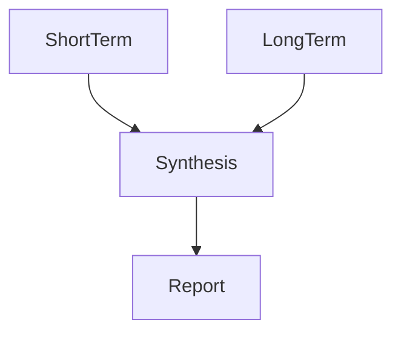

# LLM `report.md` — Markdown-Layout, Provenienz & Guardrails (Spezifikation)

Status: **Proposed (Spezifikation; Implementierung folgt später)**  
Scope: **nur** Layout/Provenienz/Guardrails/Mermaid-Default für das menschenlesbare Artefakt `report.md` (derived view auf `report.json.output.content`, vgl. ADR 0007).

## Intent

Diese Spezifikation definiert einen **eindeutigen, testbaren Markdown-Kontrakt** für `report.md`, damit Reports diffbar, menschenlesbar und zugleich auditierbar bleiben.

## Quellen (Normativ)

- Backlog-Text für Layout/Provenienz/Guardrails/Mermaid: [`TODO.md`](../../../TODO.md:357)
- Output-Container/Artefakte & „derived view“-Prinzip: [`docs/adr/0007-llm-output-formats-json-vs-markdown.md`](../adr/0007-llm-output-formats-json-vs-markdown.md:1)
- Evidence-Pattern/Pointer-Prinzip (Transcript-Evidence): [`docs/analysis/llm_prompt_spec_strict_json_evidence.md`](llm_prompt_spec_strict_json_evidence.md:1)
- Rolling-Window Semantik (Short-term vs Long-term Auswahl): [`docs/analysis/llm_report_rolling_window_semantics.md`](llm_report_rolling_window_semantics.md:1)

## Ist vs. Proposed (klarer Status)

### Ist (evidenzbasiert, implementiert)

- Das System schreibt `report.json` und ein derived menschenlesbares Artefakt (`report.md` **oder** `report.txt`) unter `output/history/<topic>/<YYYY-MM-DD>/<HISTORY_BUNDLE>/` (siehe ADR 0007). Quelle: [`docs/adr/0007-llm-output-formats-json-vs-markdown.md`](../adr/0007-llm-output-formats-json-vs-markdown.md:11)
- **Dieses Dokument ändert keine Artefakt-Pfade und keine Writer-Logik.** Es definiert nur, *wie* `report.md` aussehen soll, falls `output.content` Markdown ist.

### Proposed (Spezifikation; noch nicht implementiert)

- Wenn der derived Report `report.md` ist, muss er das Layout in dieser Spezifikation erfüllen (H1 + Header + fixe Sections + Provenienz/Guardrails + Mermaid-Default).

---

## 1) Dateityp & allgemeine Formatregeln (normativ)

### 1.1 Encoding & Zeilenenden

- `report.md` ist UTF-8.
- Zeilenenden sind `\n`.

### 1.2 Keine Mehrdeutigkeiten im Markdown-Gerüst

- Der Report beginnt mit **genau einem** H1-Titel (eine Zeile, die mit `# ` beginnt).
- Direkt nach dem H1 folgt ein Header-Block gemäß Abschnitt 2.
- Danach folgen exakt die Sections aus Abschnitt 3 in fixer Reihenfolge.

---

## 2) Header direkt nach H1 (normativ)

### 2.1 Header-Format (Markdown-Tabelle, fix)

Der Header muss eine Markdown-Tabelle mit **genau zwei Spalten** sein: `Field` und `Value`.

**Normative Regeln (exact match):**

- Die Tabellen-Header-Zeile muss exakt sein:
  - `| Field | Value |`
- Die Separator-Zeile muss existieren (beliebige Anzahl `-` pro Spalte ist erlaubt), z.B.:
  - `|---|---|`
- Die `Field`-Werte müssen exakt den Pflichtfeldern aus Abschnitt 2.2 entsprechen (case-sensitive, exact match).
- Jeder Pflicht-`Field` kommt **genau einmal** vor.

### 2.2 Pflichtfelder (exact match; case-sensitive)

Die folgenden `Field`-Keys sind **required**:

- `analysis_run_at_utc`
- `short_term_window_days`
- `long_term_window_days`
- `short_term_inputs_count`
- `long_term_sources_included_count`
- `long_term_sources_date_range_utc`
- `generator`

Hinweise (normativ):

- `long_term_sources_date_range_utc` enthält **min/max** als Textwert (Format ist frei, aber beide Grenzen müssen enthalten sein).
- `generator` ist ein Textfeld (mindestens: Name der Pipeline-Komponente). Diese Spezifikation führt **keine** neuen JSON-Felder ein; es ist reiner Reporttext.

---

## 3) Sections (normativ; Reihenfolge fix)

Nach dem Header müssen genau die folgenden H2-Sections in dieser Reihenfolge erscheinen (Titel exact match):

1. `## Executive Summary`
2. `## Short-term Findings`
3. `## Long-term Findings`
4. `## Evidence Index`
5. `## Sources`
6. `## Method Notes`

Erlaubt (normativ):

- Sub-Headings unterhalb dieser H2-Sections (z.B. `###`), solange die H2-Reihenfolge unverändert bleibt.

Nicht erlaubt (normativ):

- Zusätzliche H2-Sections.
- Umbenennungen oder alternative Schreibweisen (z.B. `## Evidence` statt `## Evidence Index`).

---

## 4) Provenienz-Regeln: `new` vs `inherited` (normativ)

### 4.1 Grundregel: genau eine Provenienz pro Statement

**Normative Regel:** Jede einzelne Aussage/These im Report trägt exakt eine Provenienz-Klasse: `new` oder `inherited`. Quelle: [`TODO.md`](../../../TODO.md:387)

**Normative Regel:** Es gibt **kein** Statement ohne Provenienz-Markierung. Quelle: [`TODO.md`](../../../TODO.md:396)

### 4.2 Sichtbarkeitskonvention (Prefix; exact match)

Die Provenienz muss als Prefix am Anfang eines Statements sichtbar sein.

- Für `new`: Prefix exakt `[new]`
- Für `inherited`: Prefix exakt `[inherited|<status>]` (siehe Status-Enum in Abschnitt 5.3)

Ein „Statement“ ist normativ:

- eine Bullet-Zeile (beginnend mit `- ` oder `* `), oder
- ein Absatz (nicht-listiger Textblock).

**Normative Regel:** In `report.md` sollen Statements bevorzugt als Bullets formuliert werden; wenn Absätze verwendet werden, muss das Prefix am Absatzanfang stehen.

### 4.3 Regeln für `new`

**Normative Regel:** Jede `new` Aussage muss mindestens einen Evidence-Verweis auf Short-term Transcript-Evidence enthalten. Quelle: [`TODO.md`](../../../TODO.md:388)

- Die Evidence-Verweise müssen auf Einträge im `## Evidence Index` zeigen (siehe Abschnitt 6).

### 4.4 Regeln für `inherited`

**Normative Regeln:**

- Jede `inherited` Aussage muss sichtbar markiert sein (Prefix aus 4.2) und genau **eine** Source-Referenz tragen. Quelle: [`TODO.md`](../../../TODO.md:392)
- Die Source-Referenz muss mindestens `source_analysis_date_utc` und einen stabilen Source-Identifier enthalten. Quelle: [`TODO.md`](../../../TODO.md:393)
  - Der Source-Identifier darf als String im Markdown umgesetzt werden (z.B. relativer Pfad unter `output/history/<topic>/.../`). Quelle: [`TODO.md`](../../../TODO.md:394)

Konvention (normativ) für die Source-Referenz:

- Jede `inherited` Aussage enthält am Ende `Source: <S#>`.
- `<S#>` referenziert einen Eintrag in `## Sources` (siehe Abschnitt 7).

---

## 5) Guardrails & Status-Policy (normativ)

### 5.1 Kein „inherited-as-evidence“

**Normative Regel:** `inherited` Inhalte sind **nie Evidence** für `new` Inhalte. Quelle: [`TODO.md`](../../../TODO.md:401)

Konkret (normativ):

- `## Evidence Index` enthält ausschließlich Short-term Transcript-Snippets (keine Zitate/Passagen aus früheren Reports). Quelle: [`TODO.md`](../../../TODO.md:402)

### 5.2 Keine Loops, max. 1 Hop

**Normative Regeln:**

- Eine `inherited` Aussage darf nicht auf eine Quelle referenzieren, die aus dem aktuellen Run stammt. Quelle: [`TODO.md`](../../../TODO.md:404)
- Es ist nicht erlaubt, innerhalb dieses Reports eine Quellenkette >1 Hop zu modellieren.
  - Praktisch: `inherited` referenziert immer direkt eine historische Quelle in `## Sources` und niemals eine „Quelle, die selbst inherited ist“. Quelle: [`TODO.md`](../../../TODO.md:405)

### 5.3 Status-Enum (case-sensitive, exact match)

**Normative Regel:** Jede `inherited` Aussage trägt einen Status aus folgendem Enum (case-sensitive):

- `confirmed`
- `stale`
- `needs_revalidation`
- `ambiguous`

Quelle: [`TODO.md`](../../../TODO.md:406)

Darstellung (normativ):

- Prefix exakt: `[inherited|confirmed]`, `[inherited|stale]`, `[inherited|needs_revalidation]`, `[inherited|ambiguous]`.

### 5.4 Downgrade / Removal Policy

**Normative Regel (Downgrade):** Wenn eine `inherited` Aussage im aktuellen Short-term Fenster **nicht** bestätigt werden kann, muss sie mindestens auf `needs_revalidation` oder `stale` gesetzt werden. Quelle: [`TODO.md`](../../../TODO.md:408)

**Normative Regel (ambiguous + Invalid-Liste):** Wenn eine `inherited` Aussage im Long-term Fenster liegt, aber die Source fehlt oder unlesbar ist, muss der Status `ambiguous` gesetzt werden und das Item muss in eine separate „Invalid inherited items“ Liste verschoben werden. Quelle: [`TODO.md`](../../../TODO.md:409)

Konkretisierung (normativ, testbar):

- Ein `inherited` Item gilt als **bestätigt** (→ `confirmed`) nur, wenn es im aktuellen `## Short-term Findings` durch mindestens einen Evidence-Index-Verweis (E*) gestützt ist.
- Wenn keine Bestätigung durch Short-term Evidence vorhanden ist:
  - setze `needs_revalidation` (wenn die Aussage weiterhin plausibel/als Arbeitsstand behalten werden soll) **oder**
  - setze `stale` (wenn die Aussage wahrscheinlich driftet/veraltet ist).
- Wenn die referenzierte Source (S*) nicht auflösbar ist (fehlt/unlesbar/außerhalb des Long-term Fensters):
  - setze `ambiguous` und
  - verschiebe das Item unter `## Long-term Findings` in eine Subsection `### Invalid inherited items`.

**Removal (normativ):** Items in `### Invalid inherited items` gelten als „removed from main inherited findings“ (sie dürfen nicht in der normalen inherited-Liste erscheinen, sondern nur in dieser Invalid-Liste).

---

## 6) `## Evidence Index` (normativ; nur Short-term Evidence)

### 6.1 Zweck & Scope

- `## Evidence Index` ist die **einzige** Stelle, an der wörtliche Transcript-Quotes/Snippets gesammelt werden.
- Es sind ausschließlich Evidence-Items aus dem Short-term Fenster erlaubt (kein Long-term, keine früheren Reports). Quelle: [`TODO.md`](../../../TODO.md:402)

### 6.2 Evidence-ID-Konvention (normativ)

- Jeder Evidence-Eintrag hat eine ID `E<number>`.
- Jede ID ist innerhalb des Reports eindeutig.
- `new` Statements referenzieren Evidence-IDs in der Form `Evidence: E1, E2`.

### 6.3 Evidence-Eintrag Format (normativ)

Jeder Evidence-Eintrag ist genau eine Bullet-Zeile und beginnt exakt mit:

- `- [E<number>] `

Danach muss der Eintrag mindestens enthalten:

- `video_id: <string>`
- `transcript_path: <string>`
- `quote: <string>` (wörtliches Zitat/Snippet)

Hinweis (Alignment, nicht neue APIs): Diese Felder sind an das Evidence-Pointer-Prinzip in [`docs/analysis/llm_prompt_spec_strict_json_evidence.md`](llm_prompt_spec_strict_json_evidence.md:36) angelehnt, aber als Markdown-Text repräsentiert.

---

## 7) `## Sources` (normativ; Long-term Quellenliste)

### 7.1 Source-ID-Konvention (normativ)

- Jeder Source-Eintrag hat eine ID `S<number>`.
- Jede `inherited` Aussage referenziert genau eine Source-ID (`Source: S#`). Quelle: [`TODO.md`](../../../TODO.md:392)

### 7.2 Source-Eintrag Format (normativ)

Jeder Source-Eintrag ist genau eine Bullet-Zeile und beginnt exakt mit:

- `- [S<number>] `

Danach muss der Eintrag mindestens enthalten:

- `source_analysis_date_utc: <UTC ISO-8601 string>`
- `source_id: <string>` (stabiler Identifier; empfohlen: relativer Pfad unter `output/history/<topic>/.../`)

Quelle: [`TODO.md`](../../../TODO.md:393)

---

## 8) `## Method Notes` inkl. Mermaid Default (normativ)

### 8.1 Mermaid Default: genau ein Diagramm

**Normative Regeln:**

- Unter `## Method Notes` muss standardmäßig **genau ein** Mermaid-Diagramm enthalten sein. Quelle: [`TODO.md`](../../../TODO.md:429)
- Diagrammtyp ist exakt `flowchart TD`. Quelle: [`TODO.md`](../../../TODO.md:431)
- Knoten sind exakt: `ShortTerm`, `LongTerm`, `Synthesis`, `Report`. Quelle: [`TODO.md`](../../../TODO.md:432)
- Es darf **kein weiteres** Mermaid-Diagramm im gesamten Report existieren.

### 8.2 Mermaid Template (normativ; Beispiel)



---

## 9) Minimales, konformes Beispiel (Proposed)

> Hinweis: Beispiel dient der Illustration; die Regeln oben sind normativ.

```markdown
# Global LLM Analysis Report

| Field | Value |
|---|---|
| analysis_run_at_utc | 2025-12-26T00:00:00Z |
| short_term_window_days | 30 |
| long_term_window_days | 365 |
| short_term_inputs_count | 12 |
| long_term_sources_included_count | 3 |
| long_term_sources_date_range_utc | min=2025-01-01T00:00:00Z; max=2025-12-01T00:00:00Z |
| generator | transcript_miner / llm analysis |

## Executive Summary
- [new] Short-term zeigt X. Evidence: E1
- [inherited|needs_revalidation] Langfristiger Trend Y. Source: S1

## Short-term Findings
- [new] Aussage A. Evidence: E1, E2

## Long-term Findings
- [inherited|confirmed] Aussage B (bestätigt im aktuellen Fenster). Source: S2

### Invalid inherited items
- [inherited|ambiguous] Aussage C (Quelle fehlt/unlesbar). Source: S3

## Evidence Index
- [E1] video_id: abc123; transcript_path: output/data/transcripts/by_video_id/abc123.txt; quote: "..."
- [E2] video_id: def456; transcript_path: output/data/transcripts/by_video_id/def456.txt; quote: "..."

## Sources
- [S1] source_analysis_date_utc: 2025-12-01T00:00:00Z; source_id: output/history/investing/2025-12-01/2025-12-01__0000__aggregate__abcd1234/report.json
- [S2] source_analysis_date_utc: 2025-11-01T00:00:00Z; source_id: output/history/investing/2025-11-01/2025-11-01__0000__aggregate__efgh5678/report.json
- [S3] source_analysis_date_utc: 2025-01-01T00:00:00Z; source_id: output/history/investing/2025-01-01/2025-01-01__0000__aggregate__ijkl9012/report.json

## Method Notes

```
