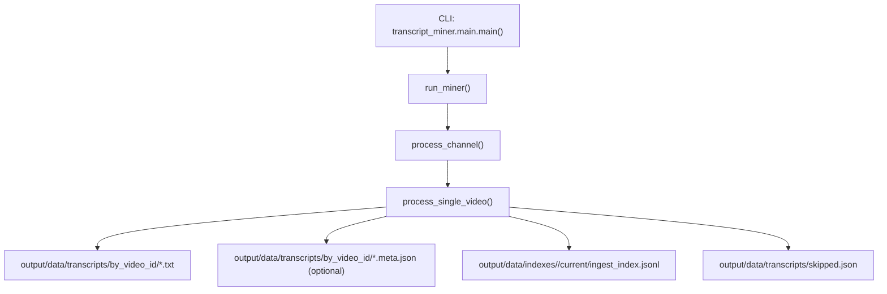
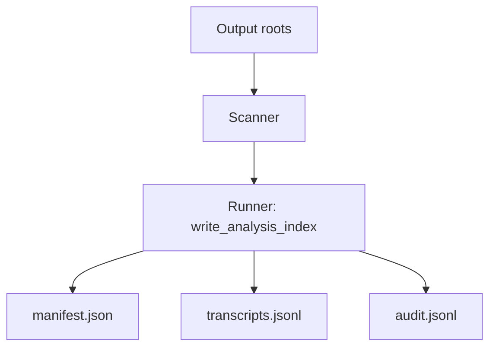
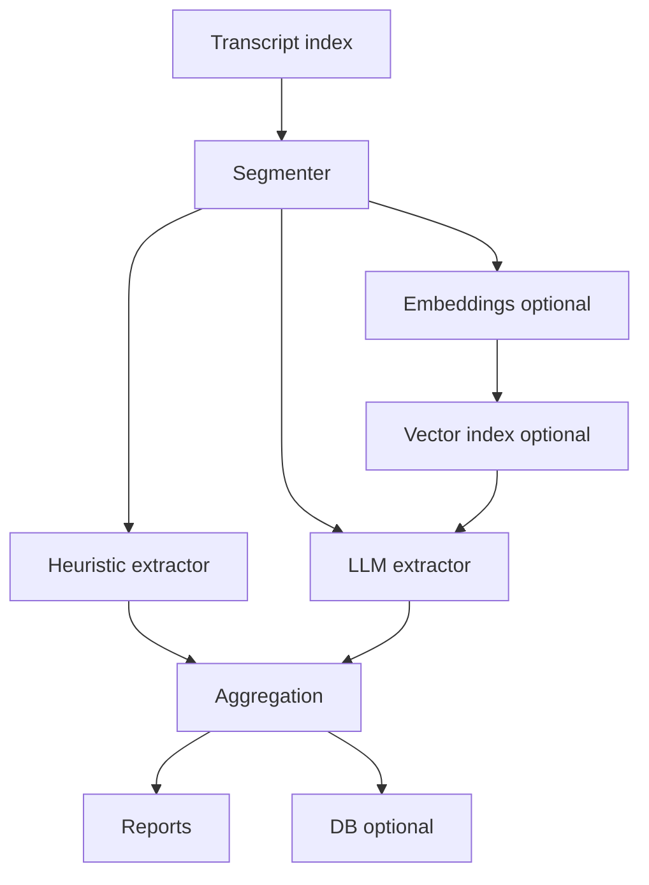

# Architektur- und Entscheidungsübersicht

Diese Doku ist der **Einstieg**, wenn du verstehen willst, wie die Pipeline (Fetch → Analysis) gedacht ist, welche Artefakte es gibt und welche Architektur-Entscheidungen noch offen sind.

Hinweis zu Code-Links in dieser Doku:

- Links im Format `pfad/datei.py:zeile` sind für VS Code (und ähnliche Editoren) optimiert und springen direkt an die referenzierte Stelle.

---

## 1) „Welche Dokumente braucht man, um das ganze Programm zu verstehen?“

Minimal-Set (in dieser Reihenfolge):

1. [`README.md`](../README.md:1)
   - Zielbild, Quickstart, Entry-Points, Output-Struktur, Offline-Analysis Index, IP-Block Troubleshooting.
2. [`docs/config.md`](config.md:1)
   - YAML-Schema, Prioritäten (CLI > Config > Env), Pfad-Policy, Proxy-Konfiguration.
3. [`TODO.md`](../../TODO.md:1)
   - Roadmap/Backlog inkl. offener Entscheidungen (Analysis Aggregation, Datenbank-Option, Multi-Config).
4. [`CHANGELOG.md`](../CHANGELOG.md:1)
   - Historie: was sich wann geändert hat (hilfreich für „warum ist das so?“).
5. [`logs/README.md`](../logs/README.md:1)
   - Welche Logs existieren, wofür sie gedacht sind.

Ergänzende Pläne:
- IP-Block Lösung: [`docs/plans/ip_block_solution.md`](plans/ip_block_solution.md:1) (Details zu Sticky Sessions & Proxies).

Entscheidungen/Architektur (ADR-Index): [`docs/adr/README.md`](adr/README.md:1)

Ergänzend als „ausführbare Spezifikation“:

- Offline-Analysis/Determinismus: [`tests/test_analysis_runner.py`](../tests/test_analysis_runner.py:1)
- CLI-Robustheit/Help: [`tests/test_smoke.py`](../tests/test_smoke.py:1)

Wenn du tiefer in die Entry-Points willst:

- Miner CLI: [`transcript_miner.main.main()`](../src/transcript_miner/main.py:226)
- Offline Index CLI: [`transcript_miner.transcript_index.__main__.main()`](../src/transcript_miner/transcript_index/__main__.py:33)

---

## 2) Glossar (Begriffe, die in TODO/Docs immer wieder vorkommen)

### 2.1 Artefakt

Ein **Artefakt** ist eine Datei/Dateimenge, die ein Pipeline-Schritt erzeugt und die als stabiler Output-Vertrag dient (Input für spätere Schritte, Audit/Beleg oder Nutzer-Output).

Belegte Beispiele im Repo:

- Analysis Index (offline Index): `manifest.json`, `transcripts.jsonl`, `audit.jsonl` (Output-Vertrag in [`write_analysis_index()`](../src/transcript_miner/transcript_index/runner.py:44)).
- Miner Outputs: `output/data/indexes/<topic>/current/ingest_index.jsonl`, `output/data/transcripts/skipped.json`, `output/data/transcripts/by_video_id/*.txt`, optional `*.meta.json` (Übersicht in [`README.md`](../README.md:300)).

### 2.2 Aggregationsziel

Ein **Aggregationsziel** ist die definierte „globale Sicht“, die wir aus vielen Einzel-Transkripten konsistent ableiten wollen.

Wichtig: Aggregation braucht einen **Merge-Key** (Identität) und eine **Duplikat-Policy**. Der vorhandene Index nutzt `video_id` as Identifikator und extrahiert diese aus dem Dateinamen (Regex [`_VIDEO_ID_RE`](../src/transcript_miner/transcript_index/scanner.py:12)).

Beispiele für Aggregationsziele (konzeptionell, noch nicht implementiert):

- „Pro Channel: welche Assets/Ticker wurden in Zeitraum X wie oft erwähnt?“
- „Global: Ranking der Assets inkl. Evidence (welches Video/Segment/Textsnippet).“

---

## 3) System-Überblick (Ist-Zustand)

### 3.1 Pipeline (Fetch → Outputs)



**Ist-Implementierung (Call-Chain, mit Code-Quellen):**

1. Einstieg (CLI): [`transcript_miner.main.main()`](../src/transcript_miner/main.py:226)
2. Start des Mining-Laufs: [`run_miner()`](../src/transcript_miner/main.py:158)
3. Pro Channel wird verarbeitet: [`process_channel()`](../src/transcript_miner/main.py:57)
4. Pro Video wird verarbeitet (Download + Schreiben von Files): [`process_single_video()`](../src/transcript_miner/video_processor.py:185)

**Outputs** (global layout; Referenz: [`README.md`](../README.md:300)):

- `output/data/transcripts/by_video_id/*.txt` (Writer: [`save_transcript()`](../src/common/utils.py:386))
- optional `output/data/transcripts/by_video_id/*.meta.json` (Builder: [`_create_metadata()`](../src/transcript_miner/video_processor.py:891))
- `output/data/indexes/<topic>/current/ingest_index.jsonl` (Writer: [`atomic_save_processed_videos()`](../src/transcript_miner/video_processor.py:128))
- `output/data/transcripts/skipped.json` (Writer: [`atomic_save_skipped_videos()`](../src/transcript_miner/video_processor.py:318))

Legacy-Layout bleibt unter `1_transcripts/`, `2_summaries/`, `3_reports/` erhalten.

### 3.2 Offline Analysis (Index = Transcript-Index)



Scan-Pattern (Ist-Verhalten): global + Legacy, siehe [`_iter_transcript_files()`](../src/transcript_miner/transcript_index/scanner.py:17).

- Global: `output/data/transcripts/by_video_id/*.txt`
- Legacy: `{output_root}/**/1_transcripts/**/*.txt` und `{output_root}/**/transcripts/*.txt`

Quellen:

- CLI: [`transcript_miner.transcript_index.__main__.main()`](../src/transcript_miner/transcript_index/__main__.py:33)
- Output-Vertrag: [`write_analysis_index()`](../src/transcript_miner/transcript_index/runner.py:44)

### 3.3 Report Generation (LLM-basiert)

Aktueller Pipeline-Pfad: `transcript_miner.main._run_analysis_pipeline_for_config()` ruft `run_aggregation()` auf. Der Aggregations-Runner erzeugt Reports via `generate_reports()` (LLM, wenn `report.llm` gesetzt ist) oder per Fallback `generate_markdown_report()` (Quelle: [`run_aggregation()`](../src/transcript_ai_analysis/aggregation_runner.py:90)).

`tools/generate_llm_report.py` bleibt als manueller Re-Run nutzbar (z.B. für spätere Re-Generierungen), ist aber **nicht** der primäre Pipeline-Pfad.

---

## 4) Aggregation (Ist-Zustand + Zielbild)

### 4.1 Ist-Zustand (implementiert)

Das Paket [`src/transcript_ai_analysis/`](../src/transcript_ai_analysis:1) enthält den aktuellen Aggregations-Runner.

- CLI Entry: `python -m transcript_ai_analysis` (siehe [`src/transcript_ai_analysis/__main__.py`](../src/transcript_ai_analysis/__main__.py:1))
- Core Runner: [`run_aggregation()`](../src/transcript_ai_analysis/aggregation_runner.py:90)
- Inputs: Index unter `output/data/indexes/<topic>/current` + Summaries unter `output/data/summaries/by_video_id/` (siehe Pfade in [`run_aggregation()`](../src/transcript_ai_analysis/aggregation_runner.py:123)).
- Outputs (Ist):
  - History-Bundle: `output/history/<topic>/<YYYY-MM-DD>/<YYYY-MM-DD>__<HHMM>__aggregate__<fingerprint>/aggregates/*.json`
  - Current Reports: `output/reports/<topic>/report_de_<YYYY-MM-DD>.md` / `report_en_<YYYY-MM-DD>.md`
  - `output/reports/<topic>/run_manifest.json` (aktueller Run)

Die detaillierte Artefakt-Spezifikation in 4.3 ist **Zielbild/Proposed** und aktuell **nicht** vollständig implementiert.

### 4.2 Warum ein Aggregations-Vertrag nötig ist

Ohne definiertes Artefakt-Layout (Schemen/Dateien/Versionierung) kann man:

- keine stabilen Tests schreiben,
- keine idempotenten Re-Runs garantieren,
- keinen späteren DB-Import sauber implementieren.

Der TODO „Datenmodell / Artefakte“ ist daher Blocker: [`TODO.md`](../../TODO.md:43).

### 4.3 Zielbild (geplant): Aggregation Artefakt-Layout + globale Aggregation

**Status:** Proposed / noch nicht vollständig implementiert. Die unten beschriebenen Artefakte
(`manifest.json`, `mentions.jsonl`, `canonicalization.jsonl`, `duplicates.jsonl`, `audit.jsonl` sowie CSV/JSON-Exports)
werden aktuell **nicht** erzeugt; Ist-Outputs siehe Abschnitt 4.1.

Diese Sektion definiert den **Artefakt-Vertrag** für die Aggregation (Extraktion → Canonicalization → Aggregation) sowie eine **globale Dedup-/Overwrite-Policy**.

**Anker/Referenzen (Ist-Zustand, Index):**

- Index Output-Vertrag (drei Dateien, Docstring): [`write_analysis_index()`](../src/transcript_miner/transcript_index/runner.py:44)
- Index `schema_version` Konzept: [`SCHEMA_VERSION`](../src/transcript_miner/transcript_index/models.py:7) + Manifest-Erzeugung in [`AnalysisManifest.create()`](../src/transcript_miner/transcript_index/models.py:40)
- Index Merge-Key/Identität = `video_id` aus Dateiname: Regex [`_VIDEO_ID_PLAIN_RE`](../src/transcript_miner/transcript_index/scanner.py:13) und [`_VIDEO_ID_SUFFIX_RE`](../src/transcript_miner/transcript_index/scanner.py:12) (siehe auch Doku in [`README.md`](../README.md:402))

#### 4.3.1 Begriffe & Invarianten

- **GLOBAL_ROOT**: Output-Root aus `output.global` (z.B. `output/`).
- **TOPIC**: Namespace aus `output.topic` (z.B. `investing`).
- **HISTORY_BUNDLE**: Run-Bundle unter `output/history/<topic>/<YYYY-MM-DD>/<YYYY-MM-DD>__<HHMM>__<model>__<fingerprint>/`.
- **PROFILE_ROOT**: Legacy-Root (`output.root_path`), nur für Rückwärtskompatibilität.
- **Artefakt**: stabiler Output-Vertrag (siehe definition in Abschnitt „Glossar“ oben).
- **Merge-Key**: primärer Identifikator für Dedup/Merge. Für Transcript-basierte Analyse ist das primär `video_id` (Index nutzt diesen Key bereits, siehe [`README.md`](../README.md:402)).

**Invarianten (normativ für Aggregation):**

1. **Idempotenz:** Ein Re-Run mit identischem Input (gleiche Transkript-Dateien + gleiche Index-Artefakte) soll deterministische Artefakte erzeugen (vgl. Index Determinismus-Konzept mit `run_fingerprint` in [`_compute_run_fingerprint()`](../src/transcript_miner/transcript_index/runner.py:27)).
2. **Auditierbarkeit:** Jede aggregierte Aussage muss bis zu mindestens `{video_id, channel_namespace, transcript_path}` zurückverfolgbar sein (Index liefert diese Referenzen in `transcripts.jsonl`, siehe Doku in [`README.md`](../README.md:372)).
3. **Keine stillen Overwrites ohne Policy:** Overwrite-Verhalten muss klar spezifiziert sein (Repo-Regel: [`AGENTS.md`](../../AGENTS.md:138)).

#### 4.3.2 Verzeichnisstruktur (Aggregation) unterhalb von GLOBAL_ROOT (Zielbild)

Aggregations-Artefakte liegen **getrennt** von den Miner-Outputs (insbesondere getrennt von `output/data/transcripts/` und `ingest_index.jsonl`, siehe Miner-Outputs in [`README.md`](../README.md:300)).

Normative Struktur:

```text
output/
├── data/
│   └── indexes/<topic>/current/
│       ├── manifest.json
│       ├── transcripts.jsonl
│       └── audit.jsonl
└── history/<topic>/<YYYY-MM-DD>/<HISTORY_BUNDLE>/
    └── aggregates/
        ├── by_channel.json
        ├── by_symbol.json
        └── global.json
```

Zusätzlich existieren abgeleitete, **kompatible** Export-Artefakte unter `HISTORY_BUNDLE/aggregates/` (geplant, aktuell nicht erzeugt):

- deterministisch aus Mentions ableitbar ("mentioned"):
  - `stock_coverage_counts.csv` (CSV `ticker,count`)
  - `stock_to_influencers.json` (JSON `ticker -> [channel_namespace...]`)
  - `coverage_evidence.jsonl` (JSONL pro `(ticker, channel_namespace)`)

**Begründung:**

- `output/data/indexes/<topic>/current` entspricht exakt dem existierenden Layout aus [`write_analysis_index()`](../src/transcript_miner/transcript_index/runner.py:44) (nur Pfad-Namespace). Damit können Aggregations-Schritte eindeutig auf einen konkreten Index-Lauf referenzieren.
- `HISTORY_BUNDLE/aggregates` ist ein eigener Namespace, um Schema-Versionierung und Re-Runs der Aggregation unabhängig vom Index zu halten.

#### 4.3.3 Overwrite-/Idempotenz-Policy (Aggregation, Zielbild)

**Policy (normativ):**

- Artefakte unter `HISTORY_BUNDLE/aggregates/` werden bei jedem Aggregations-Run **vollständig neu berechnet** und **atomar ersetzt** (Pattern wie in Index via `*.tmp` + `replace()`, siehe [`_atomic_write_text()`](../src/transcript_miner/transcript_index/runner.py:11) und [`_atomic_write_json()`](../src/transcript_miner/transcript_index/runner.py:20)).
- Ein Aggregations-Run muss einen **Input-Fingerprint** persistieren, so dass ein nachfolgender Run erkennen kann, ob Inputs identisch sind (siehe `run_fingerprint`-Konzept in Index: [`AnalysisManifest.run_fingerprint`](../src/transcript_miner/transcript_index/models.py:38) + Berechnung in [`_compute_run_fingerprint()`](../src/transcript_miner/transcript_index/runner.py:27)).
- Optional (aber empfohlen): Wenn Input-Fingerprint identisch ist, darf die Aggregation den Run als „no-op“ behandeln; das ist eine Optimierung, keine Semantik.

#### 4.3.4 Merge/Dedup-Policy (global, über viele Transcript-Roots, Zielbild)

Ziel: aus vielen Transkriptdateien (auch aus mehreren Output-Roots) eine **globale, deterministische Sicht** auf „welche Videos existieren“ und deren abgeleitete Mentions/Aggregate.

**Inputs (Aggregation):**

- Primärer Input ist der Index (`transcripts.jsonl`), der `video_id`, `channel_namespace`, `transcript_path` enthält (siehe [`README.md`](../README.md:372)).

**Dedup-Key (normativ):**

- Globaler Dedup erfolgt über `video_id`.

**Duplikat-Definition:**

- Ein Duplikat liegt vor, wenn mehrere `TranscriptRef`-Zeilen denselben `video_id` haben (Index zählt `unique_video_count` genau so, siehe Manifest-Feld in [`README.md`](../README.md:368)).

**Auswahl der „primären“ Transcript-Quelle pro `video_id` (deterministisch):**

1. Sortiere Kandidaten stabil nach:
   1) `channel_namespace` (lexikografisch)
   2) `transcript_path` (lexikografisch)
   3) `metadata_path` (lexikografisch; `null` sortiert zuletzt)
2. Wähle den ersten Eintrag als `primary`.

**Begründung:**

- Index ist bereits deterministisch in Scan- und Output-Reihenfolge (siehe Determinismus-Abschnitt in [`README.md`](../README.md:396)). Die obige Auswahlregel ist ein **explizites**, reproduzierbares Tie-Breaking, ohne neue externe Datenquellen einzuführen.

**Transparenz:**

- Alle nicht-primären Kandidaten werden in `duplicates.jsonl` protokolliert (Schema unten), damit Nutzer/Tests erkennen können, dass und wie gededupt wurde.

#### 4.3.5 JSON-Schemas (Aggregation)

Alle Aggregations-Artefakte müssen folgende Grundprinzipien erfüllen:

- **Schema-Versionierung:** jedes Top-Level-JSON (`*.json`) enthält `schema_version` als Integer.
- **JSONL:** pro Zeile ein Objekt, ohne Wrapper-Array.
- **Felder sind additive-erweiterbar:** neue Felder dürfen ergänzt werden, ohne bestehende Consumer zu brechen; Breaking Changes erfordern `schema_version++` (Policy analog zu Index, siehe [`README.md`](../README.md:352)).

##### A) `HISTORY_BUNDLE/aggregates/manifest.json` (Run-Metadaten, Zielbild)

Zweck: „Was wurde analysiert und mit welcher deterministischen Input-Identität?“

Schema (normativ):

```json
{
  "schema_version": 1,
  "batch": "aggregation",
  "source_index": {
    "schema_version": 1,
    "run_fingerprint": "<sha256-hex>",
    "manifest_path": "<string>"
  },
  "input": {
    "transcripts_jsonl_path": "<string>",
    "audit_jsonl_path": "<string>"
  },
  "counters": {
    "transcript_ref_count": 0,
    "unique_video_count": 0,
    "mention_count": 0,
    "canonical_mention_count": 0,
    "duplicate_video_count": 0
  },
  "run_fingerprint": "<sha256-hex>",
  "created_at_utc": "<iso-8601 string>"
}
```

Feld-Notes / Evidenz:

- `source_index.schema_version` ist verankert in Index via [`SCHEMA_VERSION`](../src/transcript_miner/transcript_index/models.py:7).
- `created_at_utc` ist **nicht** Teil des Determinismus (es ist Audit-Metadatum); deterministischer Vergleich erfolgt über `run_fingerprint` (Pattern: Index nutzt absichtlich keinen Timestamp in `manifest.json`, siehe Motivation in [`_compute_run_fingerprint()`](../src/transcript_miner/transcript_index/runner.py:27)).

##### B) `HISTORY_BUNDLE/aggregates/mentions.jsonl` (Extraktionsergebnis, roh, Zielbild)

Zweck: pro Transcript evidenzbasierte Roh-Mentions (z.B. Ticker/Company-Name), ohne Canonicalization.

Schema pro Zeile (normativ):

```json
{
  "schema_version": 1,
  "mention_id": "<string>",
  "video_id": "<string>",
  "channel_namespace": "<string>",
  "transcript_path": "<string>",
  "metadata_path": "<string|null>",
  "mention": {
    "raw": "<string>",
    "kind": "ticker|company|isin|unknown",
    "confidence": 0.0
  },
  "evidence": {
    "snippet": "<string>",
    "char_start": 0,
    "char_end": 0,
    "snippet_sha256": "<sha256-hex>"
  }
}
```

Notes:

- `video_id`, `channel_namespace`, `transcript_path`, `metadata_path` sind exakt die Referenzen, die Index bereits liefert (siehe [`TranscriptRef.to_json()`](../src/transcript_miner/transcript_index/models.py:21) und Doku in [`README.md`](../README.md:372)).
- `mention_id` muss deterministisch sein (z.B. Hash über `{video_id, raw, char_start, char_end}`); genaue Hash-Bildung ist Implementierungsdetail, aber die Determinismus-Anforderung ist normativ.

##### C) `HISTORY_BUNDLE/aggregates/canonicalization.jsonl` (Mapping roh → kanonisch, Zielbild)

Zweck: nachvollziehbares Mapping von Roh-Mentions auf kanonische Symbole/Entities (inkl. Ambiguität).

Schema pro Zeile (normativ):

```json
{
  "schema_version": 1,
  "mention_id": "<string>",
  "video_id": "<string>",
  "raw": "<string>",
  "canonical": {
    "symbol": "<string|null>",
    "name": "<string|null>",
    "provider": "static_map|heuristic|llm|unknown",
    "status": "resolved|ambiguous|unresolved"
  },
  "candidates": [
    {
      "symbol": "<string>",
      "name": "<string|null>",
      "score": 0.0
    }
  ],
  "notes": "<string|null>"
}
```

##### D) `HISTORY_BUNDLE/aggregates/*.json` (Aggregationen, Zielbild)

**Gemeinsames Grundschema (normativ):**

```json
{
  "schema_version": 1,
  "generated_from": {
    "aggregation_manifest_path": "<string>",
    "run_fingerprint": "<sha256-hex>"
  },
  "metrics": [
    {
      "key": "<string>",
      "unique_video_count": 0,
      "mention_count": 0,
      "mentions_raw": 0,
      "mentions_unique_video": 0,
      "mentions_unique_creator": 0,
      "evidence": [
        {
          "video_id": "<string>",
          "mention_id": "<string>",
          "transcript_path": "<string>",
          "snippet_sha256": "<sha256-hex>"
        }
      ]
    }
  ]
}
```

Konkrete Dateien:

- `aggregates/by_channel.json`: `key = channel_namespace`
- `aggregates/by_symbol.json`: `key = canonical.symbol`
- `aggregates/global.json`: `key = "global"` (ein Eintrag)

##### E) `HISTORY_BUNDLE/aggregates/duplicates.jsonl` (Duplikate pro `video_id`, Zielbild)

Zweck: explizite Dokumentation, wenn mehrere Quellen dasselbe Video liefern.

Schema pro Zeile (normativ):

```json
{
  "schema_version": 1,
  "video_id": "<string>",
  "primary": {
    "channel_namespace": "<string>",
    "transcript_path": "<string>",
    "metadata_path": "<string|null>"
  },
  "duplicates": [
    {
      "channel_namespace": "<string>",
      "transcript_path": "<string>",
      "metadata_path": "<string|null>"
    }
  ]
}
```

##### F) `HISTORY_BUNDLE/aggregates/audit.jsonl` (Audit Trail, Zielbild)

Zweck: Debugging/Belegkette (z.B. „Extraktor X hat Y Mentions aus Transcript Z erzeugt“, „Canonicalization unresolved“).

Schema pro Zeile (normativ):

```json
{
  "schema_version": 1,
  "kind": "run_started|transcript_processed|mention_extracted|canonicalization_result|warning|error",
  "video_id": "<string|null>",
  "channel_namespace": "<string|null>",
  "message": "<string>",
  "details": {"any": "json"}
}
```

#### 4.3.6 „Global Aggregation“ über Multi-Channel und Multi-Config

Diese Spezifikation trennt bewusst:

- **Multi-Channel:** mehrere Channels in *einer* Config, bereits abgesichert durch Output-Policy/Validation (siehe Doku in [`docs/config.md`](config.md:146) und Test [`test_multichannel_output_validation.py`](../tests/test_multichannel_output_validation.py:10)).
- **Multi-Config:** mehrere Configs/Output-Roots, die gemeinsam analysiert werden sollen (Backlog-Spezifikation steht noch aus, siehe [`TODO.md`](../../TODO.md:87)).

Für die Aggregation gilt in beiden Fällen die gleiche globale Dedup-Regel über `video_id` (Abschnitt 4.3.4), weil der Index diese Identität bereits standardisiert.

### 4.4 Kandidaten-Architektur (konzeptionell)



---

## 5) Architektur-Entscheidungen (ADR-Status)

Die zentralen Entscheidungen sind bereits als ADRs dokumentiert:

- Filesystem vs. Datenbank: [`docs/adr/0001-filesystem-vs-db.md`](adr/0001-filesystem-vs-db.md:1)
- Embeddings/Vector-DB: [`docs/adr/0002-embeddings-vector-db.md`](adr/0002-embeddings-vector-db.md:1)
- Sizing/Token-Budget: [`docs/adr/0003-sizing-token-budget.md`](adr/0003-sizing-token-budget.md:1)
- Parallelism/Agents: [`docs/adr/0004-parallelism-agents.md`](adr/0004-parallelism-agents.md:1)

Weitere Entscheidungen und offene Punkte bleiben im Backlog (`TODO.md`) verankert; der ADR-Index ist hier: [`docs/adr/README.md`](adr/README.md:1)

---

## 6) Token-/Volumenabschätzung (Methodik, nicht „Zahl raten“)

Im Code existiert bereits Token-Counting Support:

- optional via `tiktoken`, mit heuristischem Fallback (siehe [`common.utils.calculate_token_count()`](../src/common/utils.py:165)).

Siehe auch ADR „Sizing/Token Budget“: [`docs/adr/0003-sizing-token-budget.md`](adr/0003-sizing-token-budget.md:1)

Pragmatischer Ansatz:

1. Stichprobe von N Transkripten (z.B. 20–50 Dateien unter `output/data/transcripts/by_video_id/*.txt`).
2. Für jedes: chars, words, tokens (falls `tiktoken` installiert; sonst Fallback).
3. Extrapolation:
   - `total_tokens ≈ videos_total * avg_tokens_per_video`
4. Daraus ableiten:
   - Kontextfenster-Strategie (Chunking + Aggregation statt „alles in einen Prompt“).
